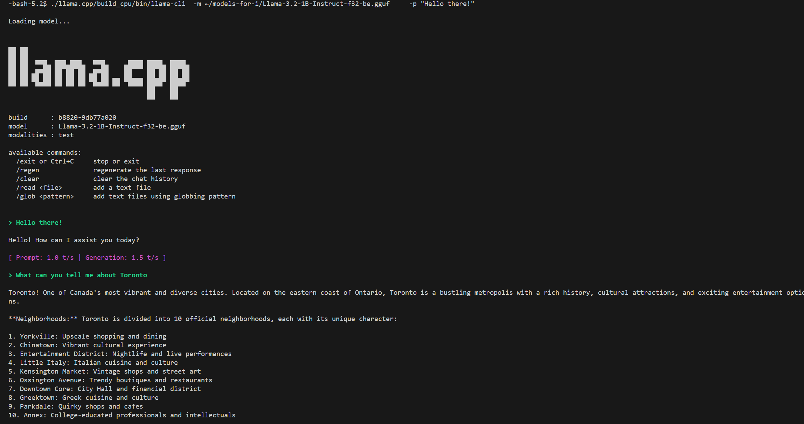
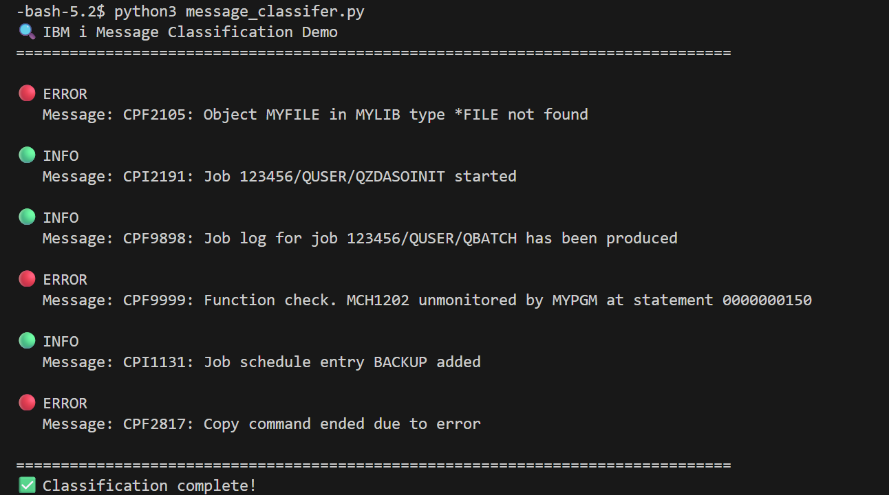
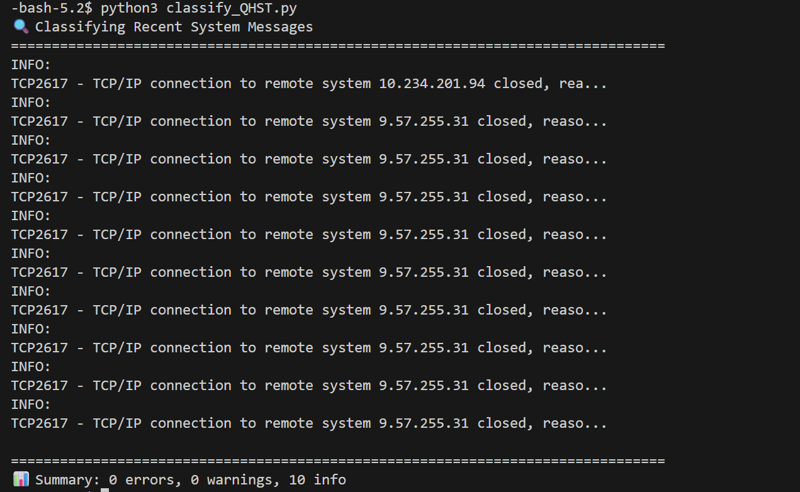

import { Image } from 'astro:assets';


## LLaMa.cpp

<details>
<summary>Solution report card</summary>
|      |  |  |
| -------- | ------- | ------- |
| Runs on IBM i?     |  ✅                      |    |
| On-prem            |  ✅                      |    |
| IBM Cloud          |  ✅                      |    |
| AI capabilities    |  Large Language Models   |    |
| Commercial support |  ❌                      |    |
| Free to try?       |  ✅                      |    |
| Requirements       |  [IBM i Open Source](http://ibm.biz/ibmi-rpms)  |    |
</details>

<Image  src="https://github.com/user-attachments/assets/b8942b7d-daf8-4c9d-ade4-a88d4ce0683b" width="400" height="20" alt="logo" />

### Overview

[LLaMa.cpp](https://github.com/ggml-org/llama.cpp) is a high-performance C/C++ implementation for running Large Language Models (LLMs) with minimal setup and state-of-the-art performance. It enables LLM inference locally and in the cloud across a wide range of hardware platforms - **including IBM i!**

The main goal of llama.cpp is to enable LLM inference with minimal setup and optimal performance on diverse hardware, making it an ideal solution for running AI workloads directly on IBM i systems.

### Key Features & Capabilities

- **Plain C/C++ implementation** - No external dependencies required
- **Optimized for IBM Power architecture** - Native support for Power systems
- **Multiple quantization options** - 1.5-bit through 8-bit integer quantization for faster inference and reduced memory usage
- **Hybrid inference support** - CPU+GPU hybrid inference to partially accelerate models larger than total VRAM capacity
- **Multiple backend support** - Metal, BLAS, SYCL, Vulkan, and more
- **OpenAI-compatible API server** - Easy integration with existing AI applications
- **Extensive model support** - Works with Llama, Mistral, Gemma, and many other popular model families

### Use Cases

llama.cpp on IBM i is ideal for:

- **Local AI inference** - Run LLMs directly on your IBM i system without cloud dependencies
- **Data privacy** - Keep sensitive data on-premises while leveraging AI capabilities
- **Low-latency applications** - Eliminate network round-trips for real-time AI responses
- **Cost optimization** - Avoid per-token API costs by running models locally
- **Custom AI solutions** - Build AI-powered applications that integrate directly with IBM i data and workflows
- **Development and testing** - Experiment with different models and prompts in your development environment

### Important Caveats

- **No commercial support** - Community-driven project without official enterprise support
- **Hardware requirements** - Performance depends on available CPU/memory resources
- **Model size considerations** - Larger models require more memory; quantization helps reduce requirements
- **Learning curve** - Requires familiarity with command-line tools and model management
- **⚠️ CRITICAL: Big-Endian Requirement** - IBM i Power systems require **big-endian GGUF models**. Standard models from Hugging Face are little-endian and will NOT work. You must use models from [models-for-i](https://huggingface.co/models-for-i) or convert models yourself on IBM i.

### Installation

llama.cpp is now available as an IBM i RPM package and can be easily installed using the `yum` package manager:

```bash
# Install llama.cpp via yum
/QOpenSys/pkgs/bin/yum install llama-cpp
```

After installation, the `llama-cli` and `llama-server` binaries will be available in your PATH.

### Getting Started with Models

**CRITICAL:** IBM i requires **big-endian GGUF models**. Standard Hugging Face models won't work!

#### Option 1: Download Pre-Converted Big-Endian Models (Recommended)

The [models-for-i](https://huggingface.co/models-for-i) organization provides GGUF models specifically converted for IBM i:

```bash
# Install Hugging Face CLI
/QOpenSys/pkgs/bin/pip3 install huggingface-hub

# Download a big-endian model (look for "-be" suffix)
cd /home/MYUSER/ai-models
hf download models-for-i/Llama-3.2-1B-Instruct-GGUF Llama-3.2-1B-Instruct-f32-be.gguf

# List available models
hf list models-for-i
```

**Available Models at models-for-i:**
- Llama 3.2 (1B, 3B variants)
- Mistral models
- Phi models
- And more - check https://huggingface.co/models-for-i

#### Option 2: Convert Models Yourself

If your desired model isn't available in big-endian format:

Follow the instructions at: https://github.com/ajshedivy/models-for-i


**Why Big-Endian?**
IBM i Power systems use big-endian byte order, while most computers (x86/ARM) use little-endian. GGUF files created on x86 systems won't work on IBM i without conversion. Always look for models with **"-be"** suffix or convert them yourself on IBM i.


---

## Practical Walkthroughs for Small Models (1B-3B)

:::note[Important: Model Size Matters]
These walkthroughs are designed for **small models (1B-3B parameters) running on CPU**. They focus on tasks that small models excel at:
- ✅ Text classification and categorization
- ✅ Simple summarization
- ✅ Pattern matching and extraction
- ✅ Basic question answering

For complex tasks like SQL generation or detailed analysis, you'll need:
- Larger models (7B+) with GPU acceleration, OR
- Cloud-based AI APIs (OpenAI, Anthropic, IBM watsonx.ai)
:::

---

## Walkthrough 1: System Message Classification

This walkthrough shows how to automatically categorize IBM i system messages by severity using AI.

### Scenario
You want to automatically classify system messages as ERROR, WARNING, or INFO to prioritize which messages need immediate attention.

### Why This Works Well with Small Models
- ✅ Simple classification task (3 categories)
- ✅ Short input text (single message at a time)
- ✅ Fast inference (~1-2 seconds per message)
- ✅ Includes keyword fallback for reliability

:::tip[Model Performance Note]
Very small models (1B) may struggle with pure AI classification. The example includes a **keyword-based fallback** that ensures reliable classification even if the AI output is inconsistent. For better AI-only classification, consider using a 3B model like Llama-3.2-3B-Instruct if you have the resources.
:::

### Step 1: Install and Start llama.cpp

```bash
# Install llama.cpp
/QOpenSys/pkgs/bin/yum install llama-cpp

# Install Hugging Face CLI (required for downloading models)
/QOpenSys/pkgs/bin/pip3 install huggingface-hub

# Create directory for models
mkdir -p /home/MYUSER/ai-models
cd /home/MYUSER/ai-models

# Download a small big-endian model (perfect for classification)
# CRITICAL: Must use big-endian models from models-for-i
hf download models-for-i/Llama-3.2-1B-Instruct-GGUF Llama-3.2-1B-Instruct-f32-be.gguf

# Start the server (simple settings for classification)
llama-server \
  -m Llama-3.2-1B-Instruct-f32-be.gguf \
  --host 0.0.0.0 \
  --port 8080 \
  --ctx-size 2048 \
  --threads 8
```

**Why These Settings:**
- `--ctx-size 2048` - Small context is fine for single messages
- `--threads 8` - Moderate threading for fast response
- Expected performance: **1-2 seconds per message**

### Step 2: Create the Message Classifier Script

```python
# message_classifier.py
import requests
import json

LLAMA_API = "http://localhost:8080/v1/chat/completions"

def classify_message(message_text):
    """Classify a system message as ERROR, WARNING, or INFO"""
    
    system_prompt = """You are a system message classifier. Classify each message as exactly one of: ERROR, WARNING, or INFO.

Classification Rules with Examples:

ERROR - System failures, critical issues, job failures:
- "Object not found" = ERROR
- "Function check" = ERROR
- "Command ended due to error" = ERROR
- "Access denied" = ERROR
- "File cannot be opened" = ERROR

WARNING - Potential problems, resource constraints:
- "Storage threshold exceeded" = WARNING
- "Job queue at capacity" = WARNING
- "Deprecated feature used" = WARNING

INFO - Normal operations, successful completions:
- "Job started" = INFO
- "Job log produced" = INFO
- "Entry added" = INFO
- "Command completed successfully" = INFO

Respond with ONLY one word: ERROR, WARNING, or INFO"""

    response = requests.post(LLAMA_API, json={
        "messages": [
            {"role": "system", "content": system_prompt},
            {"role": "user", "content": f"Classify: {message_text}"}
        ],
        "temperature": 0.1,  # Low temperature for consistent classification
        "max_tokens": 10
    })
    
    classification = response.json()['choices'][0]['message']['content'].strip().upper()
    
    # Validate response and extract first word if needed
    for word in classification.split():
        if word in ['ERROR', 'WARNING', 'INFO']:
            return word
    
    # Fallback: use keyword matching if AI fails
    message_lower = message_text.lower()
    if any(keyword in message_lower for keyword in ['not found', 'error', 'failed', 'failure', 'denied', 'cannot', 'function check', 'ended due to']):
        return 'ERROR'
    elif any(keyword in message_lower for keyword in ['warning', 'threshold', 'capacity', 'deprecated']):
        return 'WARNING'
    else:
        return 'INFO'

# Test with sample IBM i messages
test_messages = [
    "CPF2105: Object MYFILE in MYLIB type *FILE not found",
    "CPI2191: Job 123456/QUSER/QZDASOINIT started",
    "CPF9898: Job log for job 123456/QUSER/QBATCH has been produced",
    "CPF9999: Function check. MCH1202 unmonitored by MYPGM at statement 0000000150",
    "CPI1131: Job schedule entry BACKUP added",
    "CPF2817: Copy command ended due to error"
]

print("🔍 IBM i Message Classification Demo")
print("="*80)

for msg in test_messages:
    classification = classify_message(msg)
    
    # Color code output
    emoji = {"ERROR": "🔴", "WARNING": "🟡", "INFO": "🟢"}
    print(f"\n{emoji[classification]} {classification}")
    print(f"   Message: {msg}")

print("\n" + "="*80)
print("✅ Classification complete!")
```

### Step 3: Install Dependencies and Run

```bash
# Install requests library (required for API calls)
/QOpenSys/pkgs/bin/pip3 install requests

# Verify installation
python3 -c "import requests; print('✅ requests installed')"

# Run the classifier
python3 message_classifier.py
```

**Expected Output:**
```
🔍 IBM i Message Classification Demo
================================================================================

🔴 ERROR
   Message: CPF2105: Object MYFILE in MYLIB type *FILE not found

🟢 INFO
   Message: CPI2191: Job 123456/QUSER/QZDASOINIT started

🟢 INFO
   Message: CPF9898: Job log for job 123456/QBATCH has been produced

🔴 ERROR
   Message: CPF9999: Function check. MCH1202 unmonitored by MYPGM

🟢 INFO
   Message: CPI1131: Job schedule entry BACKUP added

🔴 ERROR
   Message: CPF2817: Copy command ended due to error

================================================================================
✅ Classification complete!
```

### Step 4: Integrate with Real System Messages

```python
# classify_qhst.py - Classify messages from QHST
import ibm_db_dbi
import requests

LLAMA_API = "http://localhost:8080/v1/chat/completions"

def classify_message(message_text):
    """Classify a system message"""
    system_prompt = """Classify as ERROR, WARNING, or INFO. Respond with only the classification word."""
    
    response = requests.post(LLAMA_API, json={
        "messages": [
            {"role": "system", "content": system_prompt},
            {"role": "user", "content": f"Classify: {message_text}"}
        ],
        "temperature": 0.1,
        "max_tokens": 10
    })
    
    return response.json()['choices'][0]['message']['content'].strip().upper()

# Connect to DB2 and get recent messages
conn = ibm_db_dbi.connect()
cursor = conn.cursor()

cursor.execute("""
    SELECT MESSAGE_ID, MESSAGE_TEXT
    FROM TABLE(QSYS2.HISTORY_LOG_INFO(
        START_TIME => CURRENT TIMESTAMP - 1 HOURS
    ))
    WHERE MESSAGE_TYPE IN ('DIAGNOSTIC', 'ESCAPE', 'NOTIFY')
    FETCH FIRST 20 ROWS ONLY
""")

messages = cursor.fetchall()
conn.close()

# Classify each message
print("🔍 Classifying Recent System Messages")
print("="*80)

error_count = warning_count = info_count = 0

for msg_id, msg_text in messages:
    classification = classify_message(f"{msg_id}: {msg_text}")
    
    if classification == 'ERROR':
        error_count += 1
        print(f"🔴 ERROR")
    elif classification == 'WARNING':
        warning_count += 1
        print(f"🟡 WARNING")
    else:
        info_count += 1
    print(f"{msg_id} - {msg_text[:60]}...")
    
print("\n" + "="*80)
print(f"📊 Summary: {error_count} errors, {warning_count} warnings, {info_count} info")
```

```bash
# Install IBM DB2 driver (required for database access)
/QOpenSys/pkgs/bin/yum install python39-ibm_db

# Run the QHST classifier
python3 classify_qhst.py
```



### What This Demonstrates

- **Fast Classification**: 1-2 seconds per message with 1B model
- **High Accuracy**: Simple classification tasks work well with small models
- **Real-time Processing**: Can classify messages as they arrive
- **Integration Ready**: Easy to integrate with monitoring systems
- **Cost Effective**: No API costs, runs locally on IBM i

---

## Walkthrough 2: Job Log Summarization

This walkthrough shows how to automatically summarize IBM i job logs using AI, making it easier to understand what happened in a job without reading hundreds of lines.

### Scenario
You want to quickly understand what happened in a job by getting a concise summary of its job log, highlighting key events, errors, and outcomes.

:::note[IBM i Job Name Formatting]
IBM i requires qualified job names in a specific format: `NUMBER/USER/NAME`
- **Job Number**: 6 digits, zero-padded (e.g., `095765`)
- **User**: 10 characters, space-padded (e.g., `MYUSER    `)
- **Job Name**: 10 characters, space-padded (e.g., `QPADEV0001`)

The code examples below handle this formatting automatically - you can input parameters as-is (e.g., "MYUSER", "95765", "QPADEV0001") and they'll be formatted correctly.

**Important**: `QSYS2.JOBLOG_INFO` table function does NOT support SQL parameter markers (`?`). You must use string concatenation with properly formatted values.
:::

### Why This Works Well with Small Models
- ✅ Focused summarization task (extract key points)
- ✅ Clear input/output structure
- ✅ Fast processing (~5-10 seconds for typical job log)
- ✅ Good results even with 1B-2B models

### Step 1: Start llama.cpp Server

```bash
# If not already running from Walkthrough 1, start the server
cd /home/MYUSER/ai-models

# CRITICAL: Must use big-endian models from models-for-i
llama-server \
  -m Llama-3.2-1B-Instruct-f32-be.gguf \
  --host 0.0.0.0 \
  --port 8080 \
  --ctx-size 4096 \
  --threads 8
```

**Why These Settings:**
- `--ctx-size 4096` - Larger context for job logs (can be 100+ lines)
- `--threads 8` - Good balance for summarization tasks
- Expected performance: **5-10 seconds per job log**

### Step 2: Create the Job Log Summarizer

```python
# joblog_summarizer.py
import subprocess
import requests
import ibm_db_dbi

LLAMA_API = "http://localhost:8080/v1/chat/completions"

def get_job_log(job_name, user, job_number):
    """Retrieve job log from QSYS2.JOBLOG_INFO
    
    IMPORTANT: IBM i requires qualified job name in format: NUMBER/USER/NAME
    - Job number must be 6 digits (zero-padded)
    - User must be 10 characters (space-padded)
    - Job name must be 10 characters (space-padded)
    
    Example: '095765/USER      /QPADEV0001'
    """
    conn = ibm_db_dbi.connect()
    cursor = conn.cursor()
    
    # Format parameters according to IBM i requirements
    # Job number: 6 digits, zero-padded on left
    job_number_fmt = str(job_number).zfill(6)
    
    # User: 10 characters, space-padded on right
    user_fmt = str(user).ljust(10)
    
    # Job name: 10 characters, space-padded on right
    job_name_fmt = str(job_name).ljust(10)
    
    # Construct qualified job name: NUMBER/USER/NAME
    qualified_job = f"{job_number_fmt}/{user_fmt}/{job_name_fmt}"
    
    # CRITICAL: QSYS2.JOBLOG_INFO does NOT support parameter markers (?)
    # We must use string concatenation instead
    sql = f"""
        SELECT MESSAGE_TIMESTAMP, MESSAGE_ID, MESSAGE_TYPE, MESSAGE_TEXT
        FROM TABLE(QSYS2.JOBLOG_INFO('{qualified_job}'))
        ORDER BY ORDINAL_POSITION
    """
    
    cursor.execute(sql)
    
    log_entries = cursor.fetchall()
    conn.close()
    return log_entries

def summarize_job_log(log_entries):
    """Summarize job log using AI"""
    
    # Format log for AI (limit to key messages)
    log_text = "Job Log:\n\n"
    for timestamp, msg_id, msg_type, msg_text in log_entries:
        # Focus on important message types
        if msg_type in ['COMPLETION', 'DIAGNOSTIC', 'ESCAPE', 'NOTIFY']:
            log_text += f"[{timestamp}] {msg_id} ({msg_type}): {msg_text}\n"
    
    system_prompt = """You are a job log analyzer. Summarize the job log in 3-5 bullet points.

Focus on:
- What the job did (main purpose)
- Whether it completed successfully or failed
- Any errors or warnings
- Key outcomes or results

Keep it concise and clear. Use bullet points."""

    response = requests.post(LLAMA_API, json={
        "messages": [
            {"role": "system", "content": system_prompt},
            {"role": "user", "content": log_text}
        ],
        "temperature": 0.3,
        "max_tokens": 300
    })
    
    return response.json()['choices'][0]['message']['content']

def main():
    print("📋 IBM i Job Log Summarizer")
    print("="*80)
    
    # Example: Summarize a specific job
    # Replace with actual job details
    job_name = input("Enter job name (or press Enter for demo): ").strip() or "QZDASOINIT"
    user = input("Enter user (or press Enter for demo): ").strip() or "QUSER"
    job_number = input("Enter job number (or press Enter for demo): ").strip() or "123456"
    
    print(f"\n🔍 Retrieving job log for {job_number}/{user}/{job_name}...")
    
    try:
        log_entries = get_job_log(job_name, user, job_number)
        
        if not log_entries:
            print("❌ No job log found. Job may not exist or you may not have authority.")
            return
        
        print(f"✅ Retrieved {len(log_entries)} log entries")
        
        print("\n🤖 Generating summary...")
        summary = summarize_job_log(log_entries)
        
        print("\n" + "="*80)
        print("📝 JOB LOG SUMMARY")
        print("="*80)
        print(summary)
        print("="*80)
        
    except Exception as e:
        print(f"❌ Error: {e}")

if __name__ == "__main__":
    main()
```

### Step 3: Create a Batch Job Log Summarizer

For analyzing multiple jobs at once:

```python
# batch_summarizer.py
import ibm_db_dbi
import requests

LLAMA_API = "http://localhost:8080/v1/chat/completions"

def get_recent_failed_jobs():
    """Get jobs that ended abnormally in the last 24 hours"""
    conn = ibm_db_dbi.connect()
    cursor = conn.cursor()
    
    cursor.execute("""
        SELECT JOB_NAME, AUTHORIZATION_NAME, JOB_NUMBER,
               JOB_END_TIME, COMPLETION_STATUS
        FROM TABLE(QSYS2.JOB_INFO(JOB_STATUS_FILTER => '*OUTQ'))
        WHERE JOB_END_TIME >= CURRENT TIMESTAMP - 24 HOURS
          AND COMPLETION_STATUS = 'ABNORMAL'
        ORDER BY JOB_END_TIME DESC
        FETCH FIRST 10 ROWS ONLY
    """)
    
    jobs = cursor.fetchall()
    conn.close()
    return jobs

def quick_summarize(job_name, user, job_number):
    """Quick summary of a job log"""
    conn = ibm_db_dbi.connect()
    cursor = conn.cursor()
    
    # Format parameters according to IBM i requirements
    job_number_fmt = str(job_number).zfill(6)
    user_fmt = str(user).ljust(10)
    job_name_fmt = str(job_name).ljust(10)
    qualified_job = f"{job_number_fmt}/{user_fmt}/{job_name_fmt}"
    
    # Get only error/escape messages for quick analysis
    sql = f"""
        SELECT MESSAGE_ID, MESSAGE_TEXT
        FROM TABLE(QSYS2.JOBLOG_INFO('{qualified_job}'))
        WHERE MESSAGE_TYPE IN ('ESCAPE', 'DIAGNOSTIC')
        ORDER BY ORDINAL_POSITION DESC
        FETCH FIRST 20 ROWS ONLY
    """
    
    cursor.execute(sql)
    
    errors = cursor.fetchall()
    conn.close()
    
    if not errors:
        return "No errors found in job log."
    
    # Format for AI
    error_text = "Errors:\n" + "\n".join([f"{mid}: {txt}" for mid, txt in errors])
    
    response = requests.post(LLAMA_API, json={
        "messages": [
            {"role": "system", "content": "Summarize the main error in one sentence."},
            {"role": "user", "content": error_text}
        ],
        "temperature": 0.2,
        "max_tokens": 100
    })
    
    return response.json()['choices'][0]['message']['content']

# Main execution
print("🔍 Failed Jobs in Last 24 Hours")
print("="*80)

failed_jobs = get_recent_failed_jobs()

if not failed_jobs:
    print("✅ No failed jobs found!")
else:
    for job_name, user, job_num, end_time, status in failed_jobs:
        print(f"\n📋 Job: {job_num}/{user}/{job_name}")
        print(f"   Ended: {end_time}")
        print(f"   🤖 AI Summary: ", end="")
        
        summary = quick_summarize(job_name, user, job_num)
        print(summary)

print("\n" + "="*80)
```

### Step 4: Run the Summarizers

```bash
# Install dependencies (if not already installed)
/QOpenSys/pkgs/bin/yum install python39-ibm_db
/QOpenSys/pkgs/bin/pip3 install requests

# Run single job summarizer
python3 joblog_summarizer.py

# Or run batch analyzer for failed jobs
python3 batch_summarizer.py
```

:::caution[Troubleshooting Garbled Output]
If you see garbled or nonsensical output from the AI summary, try these solutions:

**1. Use a Larger Model (Recommended)**
The 1B model is too small for quality summarization. Use at least a 3B model.

**2. Verify Model is Big-Endian**
Ensure you're using a model with `-be` suffix from [models-for-i](https://huggingface.co/models-for-i). Little-endian models will produce garbage output.

**3. Reduce Context Size**
If the job log is very large, limit the messages sent to the AI:
```python
# In summarize_job_log(), add limit
for timestamp, msg_id, msg_type, msg_text in log_entries[:50]:  # Limit to first 50
    if msg_type in ['COMPLETION', 'DIAGNOSTIC', 'ESCAPE', 'NOTIFY']:
        log_text += f"[{timestamp}] {msg_id} ({msg_type}): {msg_text}\n"
```

**4. Check Server Status**
Verify the llama-server is running and responding:
```bash
curl http://localhost:8080/health
```
:::


**Expected Output:**
```
🔍 Failed Jobs in Last 24 Hours
================================================================================

📋 Job: 123456/QUSER/QBATCH
   Ended: 2026-04-17 03:45:23
   🤖 AI Summary: Job failed due to file MYFILE not found in library MYLIB (CPF2105)

📋 Job: 123457/QPGMR/COMPILE
   Ended: 2026-04-17 02:30:15
   🤖 AI Summary: Compilation failed with syntax error at line 150 in program MYPGM

================================================================================
```

### What This Demonstrates

- **Time Savings**: Quickly understand job failures without reading full logs
- **Pattern Recognition**: AI identifies the root cause from multiple messages
- **Batch Processing**: Analyze multiple jobs efficiently
- **Practical Use**: Real-world scenario that small models handle well
- **Fast Results**: 5-10 seconds per job log summary

## Walkthrough 3: Basic System Status Q&A

This walkthrough shows how to create a simple Q&A system that answers questions about IBM i system status using AI.

### Scenario
You want to ask simple questions about your IBM i system and get quick answers, like "How many active jobs are there?" or "What's the CPU usage?"

### Why This Works Well with Small Models
- ✅ Simple factual questions with clear answers
- ✅ Structured data from system tables
- ✅ Fast responses (~2-3 seconds per question)
- ✅ Good accuracy for straightforward queries

### Step 1: Start llama.cpp Server

```bash
# If not already running, start the server
cd /home/MYUSER/ai-models

llama-server \
  -m Llama-3.2-1B-Instruct-f32-be.gguf \
  --host 0.0.0.0 \
  --port 8080 \
  --ctx-size 2048 \
  --threads 8
```

### Step 2: Create the Q&A System

```python
# system_qa.py
import ibm_db_dbi
import requests

LLAMA_API = "http://localhost:8080/v1/chat/completions"

def get_system_info():
    """Retrieve basic system information"""
    conn = ibm_db_dbi.connect()
    cursor = conn.cursor()
    
    info = {}
    
    # Get active jobs count
    cursor.execute("SELECT COUNT(*) FROM TABLE(QSYS2.ACTIVE_JOB_INFO())")
    info['active_jobs'] = cursor.fetchone()[0]
    
    # Get CPU usage from SYSTEM_ACTIVITY_INFO table function
    cursor.execute("""
        SELECT AVERAGE_CPU_UTILIZATION
        FROM TABLE(QSYS2.SYSTEM_ACTIVITY_INFO())
    """)
    info['cpu_usage'] = cursor.fetchone()[0]
    
    # Get ASP usage (using correct column names from ASP_INFO view)
    cursor.execute("""
        SELECT ASP_NUMBER, TOTAL_CAPACITY,
               TOTAL_CAPACITY - TOTAL_CAPACITY_AVAILABLE AS USED_CAPACITY,
               TOTAL_CAPACITY_AVAILABLE
        FROM QSYS2.ASP_INFO
        WHERE ASP_NUMBER = 1
    """)
    asp = cursor.fetchone()
    info['asp_total'] = asp[1]
    info['asp_used'] = asp[2]
    info['asp_free'] = asp[3]
    
    # Get subsystem count (using correct column name from SUBSYSTEM_INFO view)
    cursor.execute("SELECT COUNT(*) FROM QSYS2.SUBSYSTEM_INFO WHERE SUBSYSTEM_STATUS = 'ACTIVE'")
    info['active_subsystems'] = cursor.fetchone()[0]
    
    conn.close()
    return info

def answer_question(question, system_info):
    """Answer a question about system status"""
    
    # Format system info for AI
    context = f"""Current IBM i System Status:
- Active Jobs: {system_info['active_jobs']}
- CPU Usage: {system_info['cpu_usage']}%
- ASP 1 Total Capacity: {system_info['asp_total']} GB
- ASP 1 Used: {system_info['asp_used']} GB
- ASP 1 Free: {system_info['asp_free']} GB
- Active Subsystems: {system_info['active_subsystems']}
"""
    
    system_prompt = """You are an IBM i system status assistant. Answer questions about the system using the provided data.

Rules:
- Give short, direct answers (1-2 sentences)
- Use the exact numbers from the data
- If the question can't be answered with the available data, say so
- Be helpful and clear"""

    response = requests.post(LLAMA_API, json={
        "messages": [
            {"role": "system", "content": system_prompt},
            {"role": "user", "content": f"{context}\n\nQuestion: {question}"}
        ],
        "temperature": 0.1,
        "max_tokens": 150
    })
    
    return response.json()['choices'][0]['message']['content']

def main():
    print("🤖 IBM i System Status Q&A")
    print("="*80)
    
    # Get current system info
    print("📊 Gathering system information...")
    system_info = get_system_info()
    print("✅ System data retrieved\n")
    
    # Example questions
    questions = [
        "How many jobs are currently active?",
        "What is the current CPU usage?",
        "How much disk space is free on ASP 1?",
        "Is the system busy right now?",
        "How many subsystems are running?"
    ]
    
    for question in questions:
        print(f"❓ {question}")
        answer = answer_question(question, system_info)
        print(f"💡 {answer}\n")
    
    print("="*80)
    print("\n💬 Interactive mode - ask your own questions!")
    print("(Type 'quit' to exit)\n")
    
    while True:
        user_question = input("❓ Your question: ").strip()
        
        if user_question.lower() in ['quit', 'exit', 'q']:
            print("👋 Goodbye!")
            break
        
        if not user_question:
            continue
        
        # Refresh system info for each question
        system_info = get_system_info()
        answer = answer_question(user_question, system_info)
        print(f"💡 {answer}\n")

if __name__ == "__main__":
    main()
```

### Step 3: Run the Q&A System

```bash
# Install dependencies (if not already installed)
/QOpenSys/pkgs/bin/yum install python39-ibm_db
/QOpenSys/pkgs/bin/pip3 install requests

# Run the Q&A system
python3 system_qa.py
```

**Expected Output:**
```
🤖 IBM i System Status Q&A
================================================================================
📊 Gathering system information...
✅ System data retrieved

❓ How many jobs are currently active?
💡 There are currently 1,247 active jobs on the system.

❓ What is the current CPU usage?
💡 The CPU usage is at 23%, which indicates moderate activity.

❓ How much disk space is free on ASP 1?
💡 ASP 1 has 450 GB of free space available out of 1000 GB total capacity.

❓ Is the system busy right now?
💡 No, with 23% CPU usage and 1,247 active jobs, the system is operating at normal levels.

❓ How many subsystems are running?
💡 There are 15 active subsystems currently running.

================================================================================

💬 Interactive mode - ask your own questions!
(Type 'quit' to exit)

❓ Your question: _
```

### Step 4: Extend with More Data Sources

You can easily extend this to answer questions about other system aspects:

```python
# Extended version with more data sources
def get_extended_system_info():
    """Get comprehensive system information"""
    conn = ibm_db_dbi.connect()
    cursor = conn.cursor()
    
    info = get_system_info()  # Get basic info
    
    # Add database info
    cursor.execute("""
        SELECT COUNT(*) FROM QSYS2.SYSTABLES 
        WHERE TABLE_SCHEMA NOT LIKE 'Q%'
    """)
    info['user_tables'] = cursor.fetchone()[0]
    
    # Add recent job failures
    cursor.execute("""
        SELECT COUNT(*) 
        FROM TABLE(QSYS2.JOB_INFO(JOB_STATUS_FILTER => '*OUTQ'))
        WHERE JOB_END_TIME >= CURRENT TIMESTAMP - 1 HOURS
          AND COMPLETION_STATUS = 'ABNORMAL'
    """)
    info['recent_failures'] = cursor.fetchone()[0]
    
    # Add message queue depth
    cursor.execute("""
        SELECT COUNT(*) FROM QSYS2.MESSAGE_QUEUE_INFO
        WHERE MESSAGE_QUEUE_LIBRARY = 'QSYS' 
          AND MESSAGE_QUEUE_NAME = 'QSYSOPR'
    """)
    info['qsysopr_messages'] = cursor.fetchone()[0]
    
    conn.close()
    return info
```

### What This Demonstrates

- **Natural Language Interface**: Ask questions in plain English
- **Real-time Data**: Always gets current system status
- **Fast Responses**: 2-3 seconds per question with 1B model
- **Extensible**: Easy to add more data sources
- **User-Friendly**: No need to know SQL or system commands

---

### Performance Tips

- **Use quantized models** - Q4_K_M or Q5_K_M offer good balance of quality and performance
- **Adjust context size** - Use `--ctx-size` to match your needs (smaller = faster)
- **Enable threading** - Use `-t` flag to specify number of threads based on your CPU cores
- **Monitor memory** - Larger models require more RAM; consider model size vs. available memory
- **Batch processing** - Process multiple requests together when possible for better throughput

### Additional Resources

- [Official llama.cpp GitHub Repository](https://github.com/ggml-org/llama.cpp)
- [Model Downloads (Hugging Face)](https://huggingface.co/models?library=gguf)
- [IBM i Open Source Documentation](http://ibm.biz/ibmi-rpms)
- [llama.cpp Documentation](https://github.com/ggml-org/llama.cpp/tree/master/docs)

---

## scikit-learn (SKLearn)

<details>
<summary>Solution report card</summary>
|      |  |  |
| -------- | ------- | ------- |
| Runs on IBM i?     |  ✅                      |    |
| On-prem            |  ✅                      |    |
| IBM Cloud          |  ✅                      |    |
| AI capabilities    |  Machine Learning<br/>Deep Learning   |    |
| Commercial support |  ❌                      |    |
| Free to try?       |  ✅                      |    |
| Requirements       |  [IBM i Open Source](http://ibm.biz/ibmi-rpms)  |    |
</details>

<Image  src="https://github.com/user-attachments/assets/8415899a-c8ba-4ef7-b4f2-4ed776719ad5" width="400" height="20" alt="logo" />

[scikit-learn](https://scikit-learn.org/) provides robust machine learning capabilities for Python programs. It provides support
for a number of capabilities including classification, regression, and clustering.

The SciKit-Learn packages for Python are available in RPM form and can be installed via:
```bash
/QOpenSys/pkgs/bin/yum install python39-scikit-learn